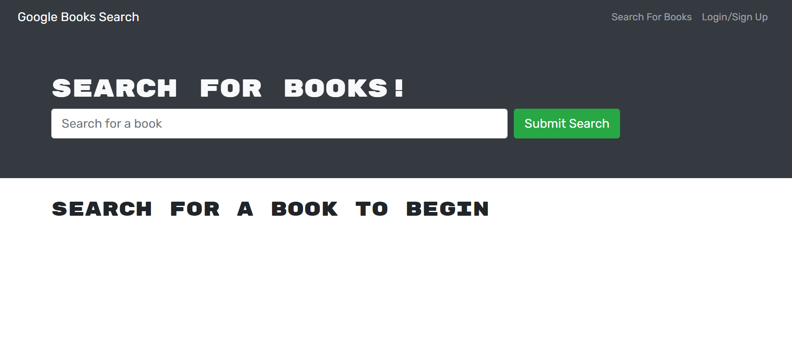
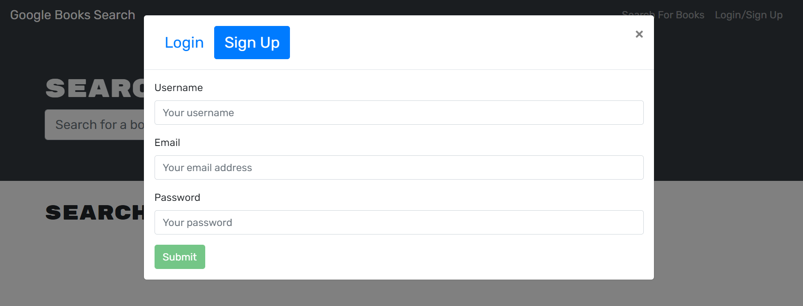
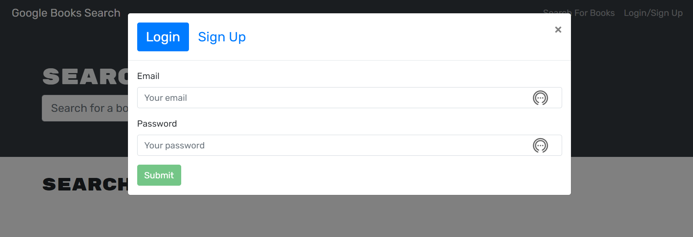
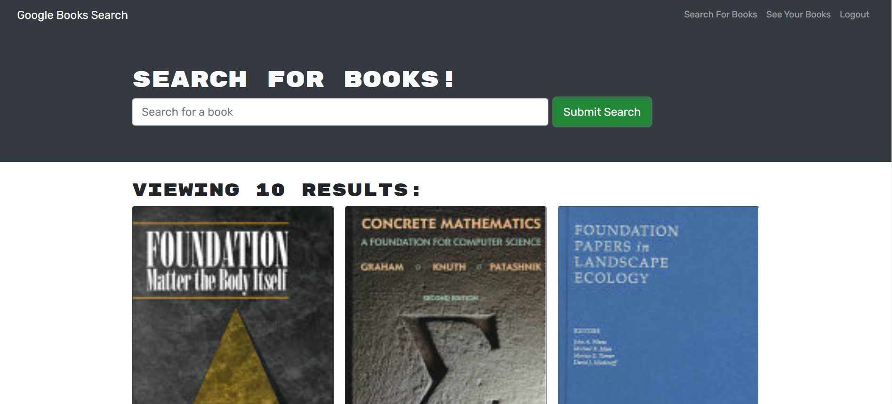
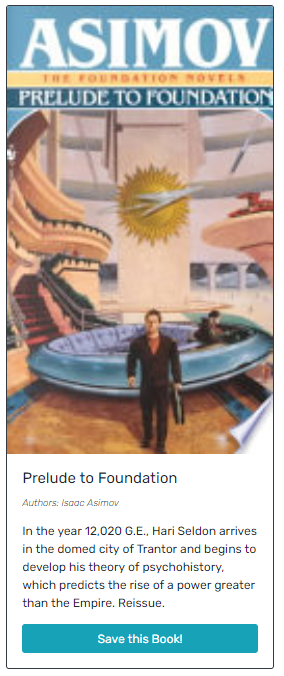
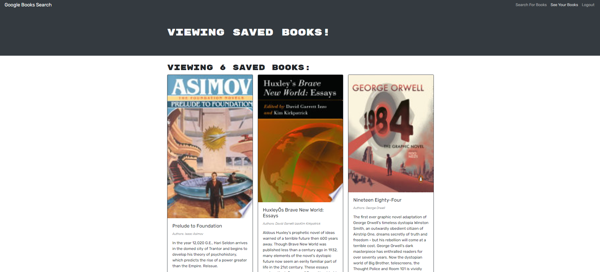
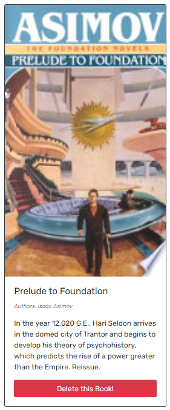

## <Book-Search-Engine>

## Table of Contents

  - [Description](#description)
  - [Installation](#installation)
  - [Usage](#usage)
  - [Credits](#credits)
  - [GitHub](#github)
  - [Features](#features)

## Description

This application is built on the cloud with a MERN Stack framework and uses the Google Book API. It allows the avid reader to search for books of interest and to add them to a personal collection. Whether the book is added or not to the collection, the user can look at in-depth details once the book is displayed in the results. An unified system that can access millions of volumes in hundreths of languages is a tool that will enhance the avid reader's possibilities to access ideas and stories in the information age.

## Installation

No installation is needed. This application is run in a live webpage.

## Usage

To use this application, go to the deployed webpage by followig this link: [Visit the deployed page](https://googlebooks-ajp.herokuapp.com/)

Once in the landing page, go to the upper right corner and click on the button to either sign up or login.

After login, type a book title and click on the search button at the center of the page. This will present to you a set of books related to the title that you typed.

Once in the results page, you can scroll down to see the full list of books, where you can click on the save button to add the book to your collection.

If you click on the top right corner to view your collection of saved books, the list of books that you have added to your collection will be shown.

If you want to remove the book from your collection, click on correspinding book card delete button and it will be removed from your collection.

## Credits

Third-party assets:
- [Bootstrap](https://getbootstrap.com/)
- [Google-Books-Api](https://developers.google.com/books)
- [ReactJs](https://reactjs.org/)
- [MongoDb](https://cloud.mongodb.com)
- [Apollo-Server](https://www.apollographql.com/docs/apollo-server/getting-started/)
- [GraphQL](https://graphql.org/)
- [npm](https://www.npmjs.com/)
- [bcrypt-npm](https://www.npmjs.com/package/bcrypt)
- [ExpressJs](https://expressjs.com/)
- [jsonWebToken-npm](https://jwt.io/)
- [Jest](https://jestjs.io/)
- [Heroku](https://www.heroku.com/nodejs) 

Reference material:
- [w3schools](https://www.w3schools.com/)
- [StackOverflow](https://stackoverflow.com/)
- [Apollo-Server-Docs](https://www.apollographql.com/docs/)
- [React-Docs](https://reactjs.org/docs/hello-world.html)
- [Mozilla Developer Network](https://developer.mozilla.org/en-US/)
- [CSS-TRICKS guide to flexbox](https://css-tricks.com/snippets/css/a-guide-to-flexbox/)

## GitHub

If you want to know more details, feel free to [visit the repo](https://github.com/aj-pena/Book-search-engine.git)

## Features
- MERN Stack framework

FrontEnd:
- ReactJs

BackEnd:
- Heroku
- MongoDb and MongoAtlas Cloud
- Robo3T
- ExpressJS
- Node.js
- Dependencies:
  - "concurrently" 5.1.0"
  - "apollo-server-express": "^2.15.0",
  - "bcrypt": "^4.0.1",
  - "express": "^4.17.1",
  - "graphql": "^15.5.1",
  - "jsonwebtoken": "^8.5.1",
  - "mongoose": "^5.9.10",
  - "nodemon": "^2.0.3",
  - "@apollo/client": "^3.4.17",
  - "@testing-library/jest-dom": "^4.2.4",
  - "@testing-library/react": "^9.3.2",
  - "@testing-library/user-event": "^7.1.2",
  - "bootstrap": "^4.4.1",
  - "graphql": "^16.0.1",
  - "jwt-decode": "^2.2.0",
  - "react": "^16.13.1",
  - "react-bootstrap": "^1.0.1",
  - "react-dom": "^16.13.1",
  - "react-router-dom": "^5.1.2",
  - "react-scripts": "3.4.1"
  

